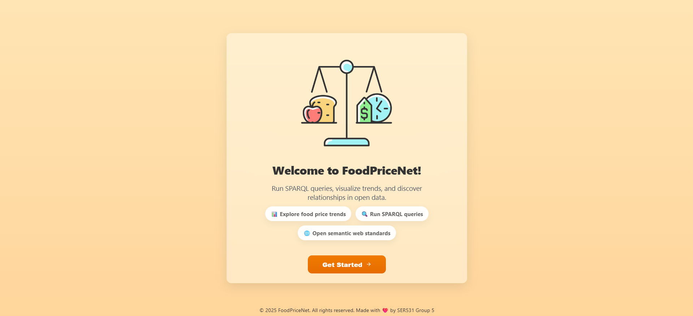
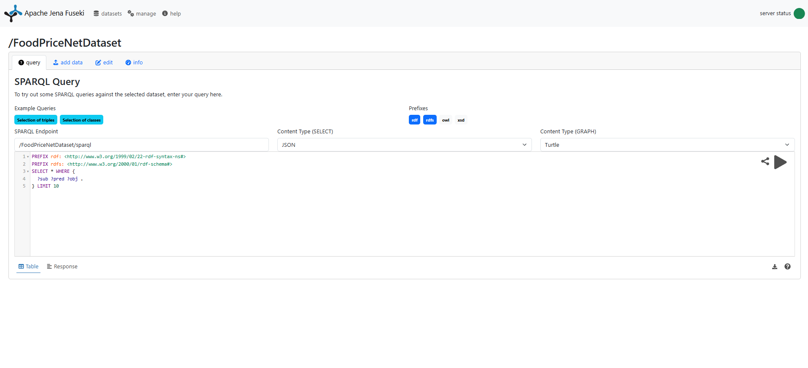
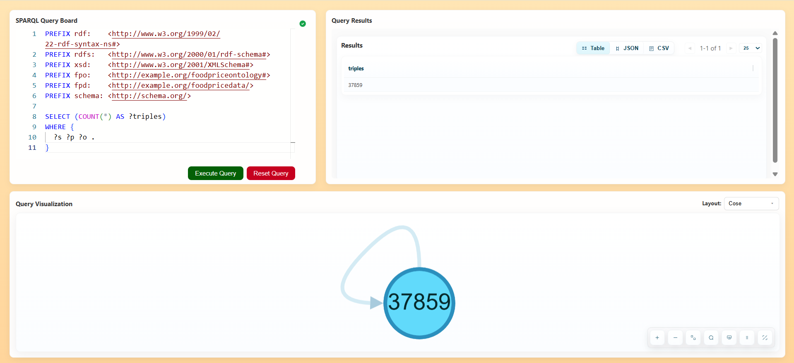
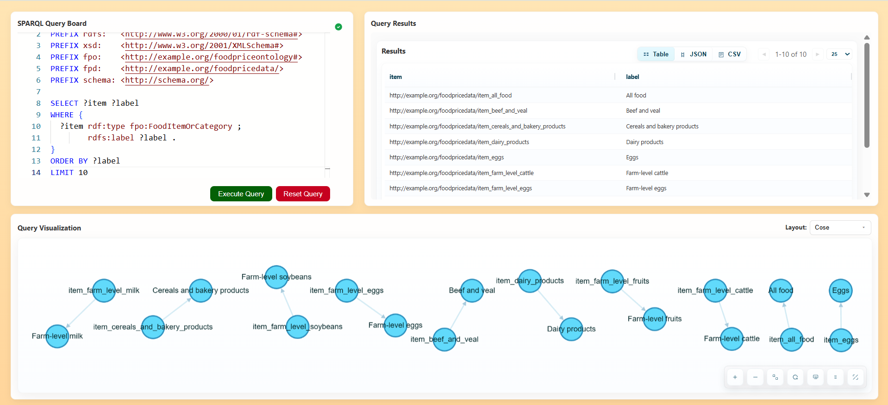
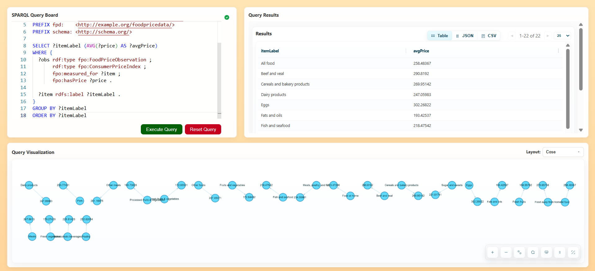

## FoodPriceNet - An Ontological Approach to Semantic Modeling of Food Price Relationships

FoodPriceNet is a semantic knowledge graph intended to represent and examine connections among food categories, the Consumer Price Index (CPI), and the Producer Price Index (PPI). Through the integration of various economic indicators into a cohesive ontology, the project provides a systematic, clear perspective on how price fluctuations correlate throughout the food supply chain from producers to end consumers.
\
\
Essentially, FoodPriceNet employs semantic web technologies (RDF, OWL, SPARQL) to depict food-economy concepts in a machine-readable and expandable format. This enables users to analyze pricing connections, connect datasets with common vocabularies, and execute intricate queries that surpass standard statistics or flat data tables.
\
\
The knowledge graph can assist in addressing queries in simple ways such as:
- In what way are shifts in producer prices (PPI) connected to subsequent consumer price movements (CPI) for particular food categories?
- In what ways do pressures on retail and wholesale prices spread across various sectors of the food economy?
- What structural relationships are present among food categories that affect the fluctuations of prices over time?

## ⚙️ Tech Stack

🔸**Frontend**: React.js
\
🔸**Backend**: Flask
\
🔸**Ontology Editor**: Protege
\
🔸**Triples Format**: Turtle (.ttl file)
\
🔸**Triple Store & SPARQL Server**: Apache Jena Fuseki

## 🎥 Application Demonstration
### Application Home Page

### Application Fuseki Server

### Sample Query 1 - Retrieve the number of triples for the FoodPriceNet KG

### Sample Query 2 - Retrieve all food categories stated in the FoodPriceNet KG

### Sample Query 3 - Retrieve the average CPI price per item in the FoodPriceNet KG

## 🏗️ Setup Instructions

...

### Contributors:

1. Janhavi Pimplikar
2. Ekta Anturkar
3. Rohith H N
4. Vatsayu Patel
5. Vidhi Patel
